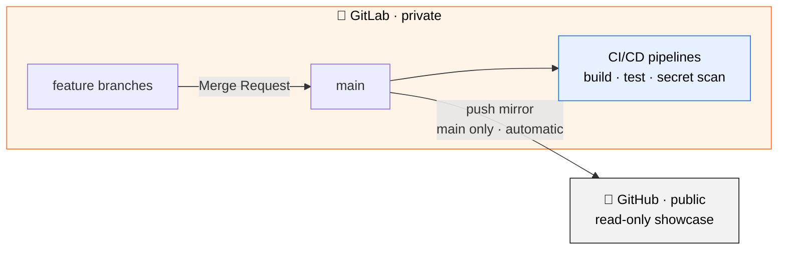
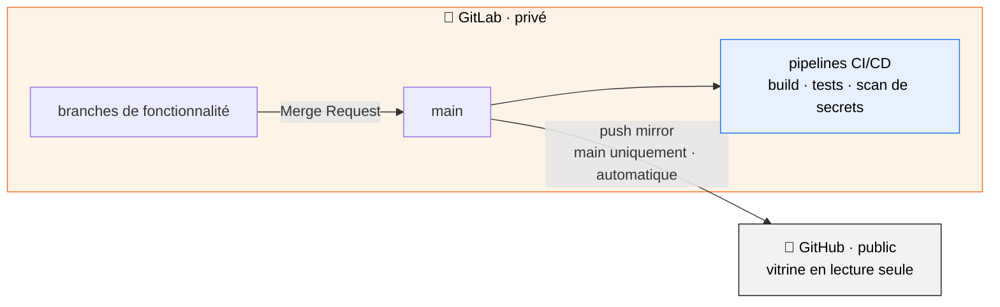

<h1 align="center">📚 QVL · Documentation</h1>

  <em>The central knowledge base for the entire QVL ecosystem.</em> 
  <em>La base de connaissances centrale de tout l'écosystème QVL.</em>

  
  
  
  
  

  <strong>🌐 Read in :</strong>&nbsp;
  <a href="#-english">🇬🇧 English</a>&nbsp;·&nbsp;
  <a href="#-français">🇫🇷 Français</a>

---

<!-- ============================== ENGLISH ============================== -->

<h3>🇬🇧&nbsp;&nbsp;English</h3>

## 📖 About this repository

Welcome to the documentation hub of **QVL**. This repository has a single mission: to **centralize the documentation of every QVL project** in one place. Rather than letting knowledge scatter across dozens of individual codebases, every architectural decision, guide and reference lives here — a single, coherent source of truth that ties the whole ecosystem together.

Whether you are a curious visitor, a developer looking to reuse a component, or simply exploring how the pieces fit together, **this is where you start**.

## 🧩 The QVL ecosystem

QVL is organized into **four distinct organizations**, each with its own audience and purpose:

| Organization | Audience | In a nutshell |
|---|---|---|
| 🎨 **QVL Studio** | General public | Open-source applications, polished and ready to use |
| 🧰 **QVL Tool Box** | Developers | Reusable services & building blocks |
| 🎮 **QVL Hobbies** | Everyone *(showcase)* | Personal leisure & hobby apps |
| 🏠 **QVL CustHome** | Private *(author only)* | Personal, private applications |

### 🎨 QVL Studio
A collection of **open-source applications aimed at the general public**. These are finished, polished products that anyone can download, use, inspect and learn from. Studio is the public face of QVL's application work — fully open and freely available to all.

### 🧰 QVL Tool Box
A **toolbox of reusable services and components**. Everything here is built to power QVL's own projects, but is deliberately designed to be **generic and reusable anywhere**. It targets developers who would rather pick up a ready-made building block than reinvent it — shared openly with the wider developer community.

### 🎮 QVL Hobbies
The home of **personal leisure and hobby applications**. These apps are **visitable by anyone**, but they behave as a **static showcase for the general public** — a curated gallery that **only the author feeds and updates**. Visitors are free to explore and enjoy; the content is driven solely by its creator.

### 🏠 QVL CustHome
A suite of **strictly personal applications**, built for and **usable only by their author**. CustHome is private by design: it is tailored to individual needs rather than intended for public use.

## 🔀 Storage & mirroring architecture

Every QVL project lives in **two synchronized places**, each with a clear role:

- **🦊 GitLab — private.** The real backbone. This is where **versioning, branches, merge requests and the CI/CD pipelines** happen. It is private, and it is the *single source of truth*.
- **🐙 GitHub — public.** The **showcase**. It is a **read-only mirror of the `main` branch**, kept automatically in sync. Nothing is ever developed directly on GitHub.

The workflow is straightforward: work happens on **branches in GitLab**, is reviewed through **merge requests**, and once merged into `main`, an automatic **push mirror** replicates `main` to GitHub — so the public showcase always reflects the latest stable state, with **zero manual effort**.

> 💡 **Open source by default** — all code visible on GitHub is, of course, **fully open source**. The public mirror is not just a showcase; it is an open invitation to read, learn from and reuse the work.

## 🤖 Built solo, with agentic AI

Every one of these projects is **developed single-handedly** by its author — a one-person effort spanning the entire ecosystem. This scale is made possible by pairing with **agentic AI (Claude)**, which acts as a tireless engineering partner across design, implementation and review.

## 🔒 Security first

Even as a solo, AI-assisted operation, **security is never an afterthought**:

- 🔍 **Automated secret scanning** — CI/CD pipelines inspect every change *and its full history*, so that **no credential, key or token ever reaches the public showcase**.
- 🛡️ **Private-by-default source** — real development stays on private GitLab; only the vetted `main` branch is ever mirrored publicly.
- ✅ **Reviewed & gated changes** — merge requests and pipeline checks guard `main` before anything becomes public.

<!-- ============================== FRANÇAIS ============================== -->

<h3>🇫🇷&nbsp;&nbsp;Français</h3>

## 📖 À propos de ce dépôt

Bienvenue dans le centre de documentation de **QVL**. Ce dépôt a une mission unique : **centraliser la documentation de tous les projets QVL** au même endroit. Plutôt que de laisser la connaissance se disperser dans des dizaines de dépôts, chaque décision d'architecture, guide et référence vit ici — une source de vérité unique et cohérente qui relie tout l'écosystème.

Que tu sois un visiteur curieux, un développeur cherchant à réutiliser un composant, ou simplement en train d'explorer comment les pièces s'assemblent, **c'est ici que tout commence**.

## 🧩 L'écosystème QVL

QVL s'organise en **quatre organisations distinctes**, chacune avec son public et sa vocation :

| Organisation | Public | En bref |
|---|---|---|
| 🎨 **QVL Studio** | Grand public | Applications open source, abouties et prêtes à l'emploi |
| 🧰 **QVL Tool Box** | Développeurs | Services & briques réutilisables |
| 🎮 **QVL Hobbies** | Tout le monde *(vitrine)* | Applications de loisirs personnelles |
| 🏠 **QVL CustHome** | Privé *(auteur uniquement)* | Applications personnelles et privées |

### 🎨 QVL Studio
Un ensemble d'**applications open source destinées au grand public**. Ce sont des produits finis et aboutis que chacun peut télécharger, utiliser, inspecter et dont il peut s'inspirer. Studio est le visage public du travail applicatif de QVL — entièrement ouvert et librement accessible à tous.

### 🧰 QVL Tool Box
Une **boîte à outils de services et de composants réutilisables**. Tout y est conçu pour alimenter les projets QVL, mais délibérément pensé pour être **générique et réutilisable partout**. Elle s'adresse aux développeurs qui préfèrent réutiliser une brique prête à l'emploi plutôt que de la réinventer — partagée ouvertement avec l'ensemble de la communauté des développeurs.

### 🎮 QVL Hobbies
Le foyer des **applications de loisirs personnelles**. Ces applications sont **visitables par tout le monde**, mais fonctionnent comme une **vitrine statique pour le grand public** — une galerie soignée **que seul l'auteur alimente et met à jour**. Les visiteurs sont libres d'explorer et d'en profiter ; le contenu est piloté uniquement par son créateur.

### 🏠 QVL CustHome
Une suite d'**applications strictement personnelles**, conçues pour et **utilisables uniquement par leur auteur**. CustHome est privé par conception : il répond à des besoins individuels plutôt qu'à un usage public.

## 🔀 Architecture de stockage & mise en miroir

Chaque projet QVL vit dans **deux emplacements synchronisés**, chacun avec un rôle bien défini :

- **🦊 GitLab — privé.** La véritable colonne vertébrale. C'est là que se déroulent le **versioning, les branches, les merge requests et les pipelines CI/CD**. Il est privé, et c'est la *source de vérité unique*.
- **🐙 GitHub — public.** La **vitrine**. C'est un **miroir en lecture seule de la branche `main`**, tenu à jour automatiquement. Rien n'est jamais développé directement sur GitHub.

Le flux est simple : le travail se fait sur des **branches dans GitLab**, est relu via des **merge requests**, et une fois fusionné dans `main`, un **push mirror** automatique réplique `main` vers GitHub — la vitrine publique reflète donc toujours le dernier état stable, **sans aucune manipulation manuelle**.

> 💡 **Open source par défaut** — tout le code visible sur GitHub est, bien évidemment, **entièrement open source**. Le miroir public n'est pas qu'une vitrine ; c'est une invitation ouverte à lire, comprendre et réutiliser le travail réalisé.

## 🤖 Développé en solo, avec l'IA agentique

Chacun de ces projets est **développé seul** par son auteur — un effort d'une seule personne à l'échelle de tout l'écosystème. Cette envergure est rendue possible par le binôme avec une **IA agentique (Claude)**, qui joue le rôle d'un partenaire d'ingénierie infatigable, de la conception à l'implémentation jusqu'à la relecture.

## 🔒 La sécurité d'abord

Même pour une activité solo assistée par IA, **la sécurité n'est jamais une pensée après coup** :

- 🔍 **Scan de secrets automatisé** — les pipelines CI/CD inspectent chaque changement *et tout son historique*, afin qu'**aucun identifiant, clé ou token n'atteigne jamais la vitrine publique**.
- 🛡️ **Source privée par défaut** — le développement réel reste sur GitLab privé ; seule la branche `main` validée est mise en miroir publiquement.
- ✅ **Changements relus et verrouillés** — merge requests et contrôles de pipeline protègent `main` avant toute publication.

---

  © QVL — Documentation · Source : <a href="https://gitlab.com/qvl-studio/Documentation">GitLab (private)</a> · Showcase : <a href="https://github.com/QVL-Studio/Documentation">GitHub (public)</a> 
  Crafted solo, with the help of agentic AI 🤖 · Conçu en solo, avec l'aide de l'IA agentique

