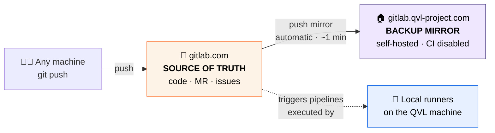
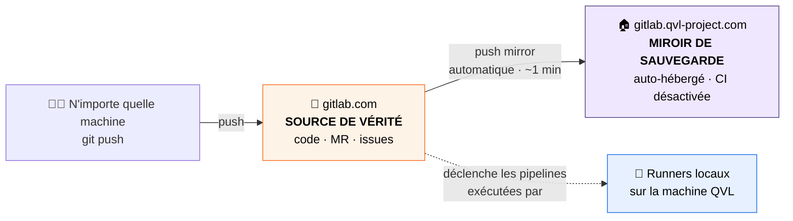

<h1 align="center">🦊 QVL · GitLab Hosting & Mirror Architecture</h1>

  <em>How QVL code is stored, duplicated and protected — in the cloud and at home.</em> 
  <em>Comment le code QVL est stocké, dupliqué et protégé — dans le cloud et à la maison.</em>

  
  
  
  

  <strong>🌐 Read in :</strong>&nbsp;
  <a href="#-english">🇬🇧 English</a>&nbsp;·&nbsp;
  <a href="#-français">🇫🇷 Français</a>

---

<!-- ============================== ENGLISH ============================== -->

<h3>🇬🇧&nbsp;&nbsp;English</h3>

## 🎯 In one sentence

QVL code lives in **two GitLab instances at once**: **gitlab.com** (the cloud, the *single source of truth*) and a **self-hosted GitLab** running on the QVL machine — an always-up-to-date **backup copy**, synchronized automatically.

> 💬 **Not a developer?** Think of it as a precious document you keep **both in a bank vault (gitlab.com) and in a fireproof safe at home (the self-hosted GitLab)**. Whatever happens to one location, the other still has an up-to-date copy — and nobody ever has to photocopy anything by hand.

## 🧭 Why two instances?

| Risk | Covered by |
|---|---|
| 💻 The home machine breaks, is stolen or dies | ✅ The code is safe on **gitlab.com** |
| ☁️ gitlab.com is unreachable or closes an account | ✅ A full copy exists on the **self-hosted instance** |
| 💸 CI/CD minute limits on gitlab.com free tier | ✅ Pipelines are computed **on the QVL machine** — see the <a href="../pipeline/ci-cd.md">CI/CD documentation</a> |

## 🏗️ The architecture

- **gitlab.com — the source of truth.** All pushes, merge requests, issues and pipeline orchestration happen here. Every machine (laptop, desktop, anywhere in the world) pushes **only** to gitlab.com.
- **gitlab.qvl-project.com — the mirror.** A full **GitLab CE** instance hosted on the QVL machine. It receives every commit automatically through a **push mirror** configured on gitlab.com, project by project. Nobody ever pushes to it directly, and its own CI is **deliberately disabled** so pipelines never run twice.

## 🖥️ How the self-hosted instance runs

| Layer | Choice | Why |
|---|---|---|
| Host | Windows 11 machine | The QVL "home server" (interim setup) |
| Linux layer | **WSL2** — Ubuntu 24.04 LTS | GitLab only ships for Linux; WSL2 provides it natively, **without Docker** |
| GitLab | **GitLab CE (omnibus)** | The official all-in-one package, updated via `apt` |
| Exposure | Cloudflare Tunnel | Public HTTPS URL — see the <a href="tunnel-cloudflare.md">tunnel documentation</a> |
| Startup | Automatic at Windows session logon | ~2 minutes of warm-up, then fully available |

## ⏱️ What to expect

| Event | Delay |
|---|---|
| Push on gitlab.com → visible on the mirror | ⚡ seconds to ~1 minute |
| Several pushes in a row | grouped, max 5 minutes between syncs |
| QVL machine **off** during a push | 😌 nothing is lost — gitlab.com retries automatically until the mirror is back |
| Machine boots + session opens | GitLab ready after ~2 minutes |

## ❓ FAQ

<b>What happens if the QVL machine is off for a week?</b>

Nothing bad. gitlab.com remains fully usable (it is the source of truth). When the machine comes back, the mirror catches up automatically on the next sync.

<b>Can I push directly to the self-hosted instance?</b>

Technically yes, but <b>never do it</b> — the mirror only flows <i>from</i> gitlab.com <i>to</i> the local instance. A direct push would be overwritten by the next sync. Always push to gitlab.com.

<b>Why is CI disabled on the mirror?</b>

Pipelines already run once, orchestrated by gitlab.com and executed by the local runners. Running them again on the mirror would double every build for zero benefit.

<!-- ============================== FRANÇAIS ============================== -->

<h3>🇫🇷&nbsp;&nbsp;Français</h3>

## 🎯 En une phrase

Le code QVL vit dans **deux instances GitLab à la fois** : **gitlab.com** (le cloud, la *source de vérité unique*) et un **GitLab auto-hébergé** qui tourne sur la machine QVL — une **copie de sauvegarde** toujours à jour, synchronisée automatiquement.

> 💬 **Pas développeur ?** Imagine un document précieux conservé **à la fois dans un coffre à la banque (gitlab.com) et dans un coffre ignifugé à la maison (le GitLab auto-hébergé)**. Quoi qu'il arrive à l'un des deux endroits, l'autre possède toujours une copie à jour — et personne n'a jamais besoin de photocopier quoi que ce soit à la main.

## 🧭 Pourquoi deux instances ?

| Risque | Couvert par |
|---|---|
| 💻 La machine maison casse, est volée ou meurt | ✅ Le code est en sécurité sur **gitlab.com** |
| ☁️ gitlab.com est injoignable ou ferme un compte | ✅ Une copie complète existe sur l'**instance auto-hébergée** |
| 💸 Limite de minutes CI/CD du plan gratuit gitlab.com | ✅ Les pipelines sont calculées **sur la machine QVL** — voir la <a href="../pipeline/ci-cd.md">documentation CI/CD</a> |

## 🏗️ L'architecture

- **gitlab.com — la source de vérité.** Tous les pushes, merge requests, issues et l'orchestration des pipelines se passent ici. Chaque machine (portable, fixe, n'importe où dans le monde) pousse **uniquement** vers gitlab.com.
- **gitlab.qvl-project.com — le miroir.** Une instance **GitLab CE** complète, hébergée sur la machine QVL. Elle reçoit chaque commit automatiquement grâce à un **push mirror** configuré sur gitlab.com, projet par projet. Personne n'y pousse jamais directement, et sa propre CI est **volontairement désactivée** pour que les pipelines ne tournent jamais en double.

## 🖥️ Comment tourne l'instance auto-hébergée

| Couche | Choix | Pourquoi |
|---|---|---|
| Hôte | Machine Windows 11 | Le « serveur maison » QVL (installation provisoire) |
| Couche Linux | **WSL2** — Ubuntu 24.04 LTS | GitLab n'existe que pour Linux ; WSL2 le fournit nativement, **sans Docker** |
| GitLab | **GitLab CE (omnibus)** | Le paquet officiel tout-en-un, mis à jour via `apt` |
| Exposition | Cloudflare Tunnel | URL HTTPS publique — voir la <a href="tunnel-cloudflare.md">documentation du tunnel</a> |
| Démarrage | Automatique à l'ouverture de session Windows | ~2 minutes de chauffe, puis totalement disponible |

## ⏱️ À quoi s'attendre

| Événement | Délai |
|---|---|
| Push sur gitlab.com → visible sur le miroir | ⚡ quelques secondes à ~1 minute |
| Plusieurs pushes d'affilée | regroupés, max 5 minutes entre deux synchros |
| Machine QVL **éteinte** pendant un push | 😌 rien n'est perdu — gitlab.com réessaie automatiquement jusqu'au retour du miroir |
| Démarrage machine + ouverture de session | GitLab prêt après ~2 minutes |

## ❓ FAQ

<b>Que se passe-t-il si la machine QVL est éteinte une semaine ?</b>

Rien de grave. gitlab.com reste pleinement utilisable (c'est la source de vérité). Au retour de la machine, le miroir se rattrape automatiquement à la synchro suivante.

<b>Puis-je pousser directement sur l'instance auto-hébergée ?</b>

Techniquement oui, mais <b>il ne faut jamais le faire</b> — le miroir ne circule que <i>de</i> gitlab.com <i>vers</i> l'instance locale. Un push direct serait écrasé à la synchro suivante. On pousse toujours vers gitlab.com.

<b>Pourquoi la CI est-elle désactivée sur le miroir ?</b>

Les pipelines tournent déjà une fois, orchestrées par gitlab.com et exécutées par les runners locaux. Les relancer sur le miroir doublerait chaque build sans aucun bénéfice.

---

  © QVL — Documentation · <a href="../README.md">Hub</a> · Voir aussi : <a href="tunnel-cloudflare.md">Tunnel Cloudflare</a> · <a href="../pipeline/ci-cd.md">CI/CD</a> 
  Crafted solo, with the help of agentic AI 🤖 · Conçu en solo, avec l'aide de l'IA agentique

