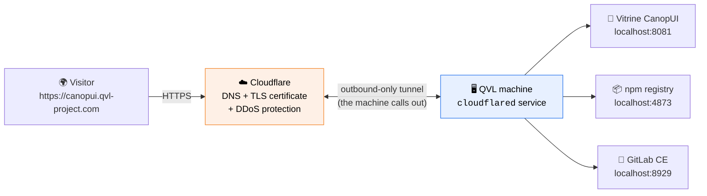
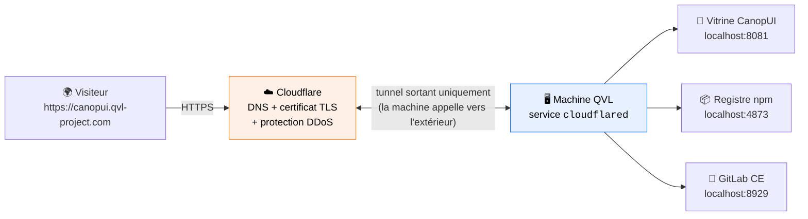

<h1 align="center">☁️ QVL · Cloudflare Tunnel</h1>

<p align="center">
  <em>One home machine, many public websites — with zero open ports.</em><br>
  <em>Une machine à la maison, plusieurs sites publics — sans aucun port ouvert.</em>
</p>

<p align="center">
  
  
  
  
</p>

<p align="center">
  <strong>🌐 Read in :</strong>&nbsp;
  <a href="#-english">🇬🇧 English</a>&nbsp;·&nbsp;
  <a href="#-français">🇫🇷 Français</a>
</p>

---

<!-- ============================== ENGLISH ============================== -->
<details open>
<summary><h3>🇬🇧&nbsp;&nbsp;English</h3></summary>

<a id="-english"></a>

## 🎯 In one sentence

A **Cloudflare Tunnel** makes services hosted on the QVL machine publicly reachable at `*.qvl-project.com`, in HTTPS, **without opening a single port** on the home router and without exposing the home IP address.

> 💬 **Not a developer?** Normally, hosting a website at home means "opening a door" in your internet router — risky, and it reveals where you live (your IP). A tunnel works the other way around: **the machine itself opens a secure line *out* to Cloudflare**, like a permanent phone call. Visitors talk to Cloudflare, and Cloudflare relays their requests through that call. Your door stays closed; your address stays hidden.

## 🏗️ How it works



Key facts:

- **The domain** `qvl-project.com` is registered and managed at Cloudflare. One domain is enough for the whole ecosystem: every service gets its own **subdomain**.
- **The tunnel** is named `qvl-infra`. A tiny program, `cloudflared`, runs as a **Windows service** (starts with the machine) and keeps a permanent, encrypted, **outbound-only** connection to Cloudflare.
- **HTTPS is automatic.** Cloudflare terminates TLS at its edge with its own certificates — nothing to renew, ever.
- **Routing is declarative**: a single configuration file maps each public hostname to a local port (*ingress rules*).

## 🗺️ Exposed services

| Public URL | Service | Local target |
|---|---|---|
| `canopui.qvl-project.com` | 🎨 CanopUI showcase (Ladle) | `localhost:8081` |
| `npm.qvl-project.com` | 📦 Private npm registry (Verdaccio) | `localhost:4873` |
| `gitlab.qvl-project.com` | 🦊 Self-hosted GitLab (mirror) | `localhost:8929` |

## ➕ Adding a new service

Three steps, ~2 minutes:

1. Make the service listen on a local port — e.g. `localhost:3001`.
2. Create the DNS route: `cloudflared tunnel route dns qvl-infra newapp.qvl-project.com`
3. Add an ingress block to the tunnel configuration, then restart the `cloudflared` service:

```yaml
- hostname: newapp.qvl-project.com
  service: http://localhost:3001
```

> ⚠️ **Port discipline** — never reuse a port already taken by the infrastructure (see table above) or by GitLab's internal services. Each new app gets its own dedicated port.

## ❓ FAQ

<details>
<summary><b>Is the home IP address visible to visitors?</b></summary>
No. Visitors only ever see Cloudflare's servers. The machine's connection to Cloudflare is outbound, so the home IP is never published anywhere (it does not even need to be static).
</details>

<details>
<summary><b>What if the machine is off?</b></summary>
The public URLs answer with a Cloudflare error page until the machine (and the tunnel service) is back. Nothing to reconfigure — the tunnel reconnects automatically.
</details>

<details>
<summary><b>Is it free?</b></summary>
The tunnel and HTTPS are part of Cloudflare's free plan. The only cost is the domain name (~10 €/year).
</details>

</details>

<!-- ============================== FRANÇAIS ============================== -->
<details>
<summary><h3>🇫🇷&nbsp;&nbsp;Français</h3></summary>

<a id="-français"></a>

## 🎯 En une phrase

Un **Cloudflare Tunnel** rend les services hébergés sur la machine QVL accessibles publiquement sur `*.qvl-project.com`, en HTTPS, **sans ouvrir le moindre port** sur la box internet et sans exposer l'adresse IP du domicile.

> 💬 **Pas développeur ?** Normalement, héberger un site chez soi oblige à « ouvrir une porte » dans sa box internet — risqué, et cela révèle où l'on habite (son IP). Un tunnel fonctionne à l'envers : **c'est la machine elle-même qui ouvre une ligne sécurisée *vers* Cloudflare**, comme un appel téléphonique permanent. Les visiteurs parlent à Cloudflare, et Cloudflare relaie leurs demandes à travers cet appel. Ta porte reste fermée ; ton adresse reste cachée.

## 🏗️ Comment ça marche



Les points clés :

- **Le domaine** `qvl-project.com` est enregistré et géré chez Cloudflare. Un seul domaine suffit pour tout l'écosystème : chaque service reçoit son propre **sous-domaine**.
- **Le tunnel** s'appelle `qvl-infra`. Un petit programme, `cloudflared`, tourne en **service Windows** (démarre avec la machine) et maintient une connexion permanente, chiffrée et **uniquement sortante** vers Cloudflare.
- **Le HTTPS est automatique.** Cloudflare termine le TLS sur ses serveurs avec ses propres certificats — rien à renouveler, jamais.
- **Le routage est déclaratif** : un unique fichier de configuration associe chaque nom d'hôte public à un port local (*règles d'ingress*).

## 🗺️ Services exposés

| URL publique | Service | Cible locale |
|---|---|---|
| `canopui.qvl-project.com` | 🎨 Vitrine CanopUI (Ladle) | `localhost:8081` |
| `npm.qvl-project.com` | 📦 Registre npm privé (Verdaccio) | `localhost:4873` |
| `gitlab.qvl-project.com` | 🦊 GitLab auto-hébergé (miroir) | `localhost:8929` |

## ➕ Ajouter un nouveau service

Trois étapes, ~2 minutes :

1. Faire écouter le service sur un port local — ex. `localhost:3001`.
2. Créer la route DNS : `cloudflared tunnel route dns qvl-infra newapp.qvl-project.com`
3. Ajouter un bloc d'ingress à la configuration du tunnel, puis redémarrer le service `cloudflared` :

```yaml
- hostname: newapp.qvl-project.com
  service: http://localhost:3001
```

> ⚠️ **Discipline des ports** — ne jamais réutiliser un port déjà pris par l'infrastructure (voir tableau ci-dessus) ou par les services internes de GitLab. Chaque nouvelle application reçoit son propre port dédié.

## ❓ FAQ

<details>
<summary><b>L'adresse IP du domicile est-elle visible par les visiteurs ?</b></summary>
Non. Les visiteurs ne voient jamais que les serveurs de Cloudflare. La connexion de la machine vers Cloudflare est sortante : l'IP du domicile n'est publiée nulle part (elle n'a même pas besoin d'être fixe).
</details>

<details>
<summary><b>Et si la machine est éteinte ?</b></summary>
Les URLs publiques répondent avec une page d'erreur Cloudflare jusqu'au retour de la machine (et du service tunnel). Rien à reconfigurer — le tunnel se reconnecte automatiquement.
</details>

<details>
<summary><b>Est-ce gratuit ?</b></summary>
Le tunnel et le HTTPS font partie du plan gratuit de Cloudflare. Le seul coût est le nom de domaine (~10 €/an).
</details>

</details>

---

<p align="center">
  <sub>© QVL — Documentation · <a href="../README.md">Hub</a> · Voir aussi : <a href="hebergement-gitlab.md">Hébergement GitLab</a> · <a href="../pipeline/ci-cd.md">CI/CD</a></sub><br>
  <sub>Crafted solo, with the help of agentic AI 🤖 · Conçu en solo, avec l'aide de l'IA agentique</sub>
</p>
