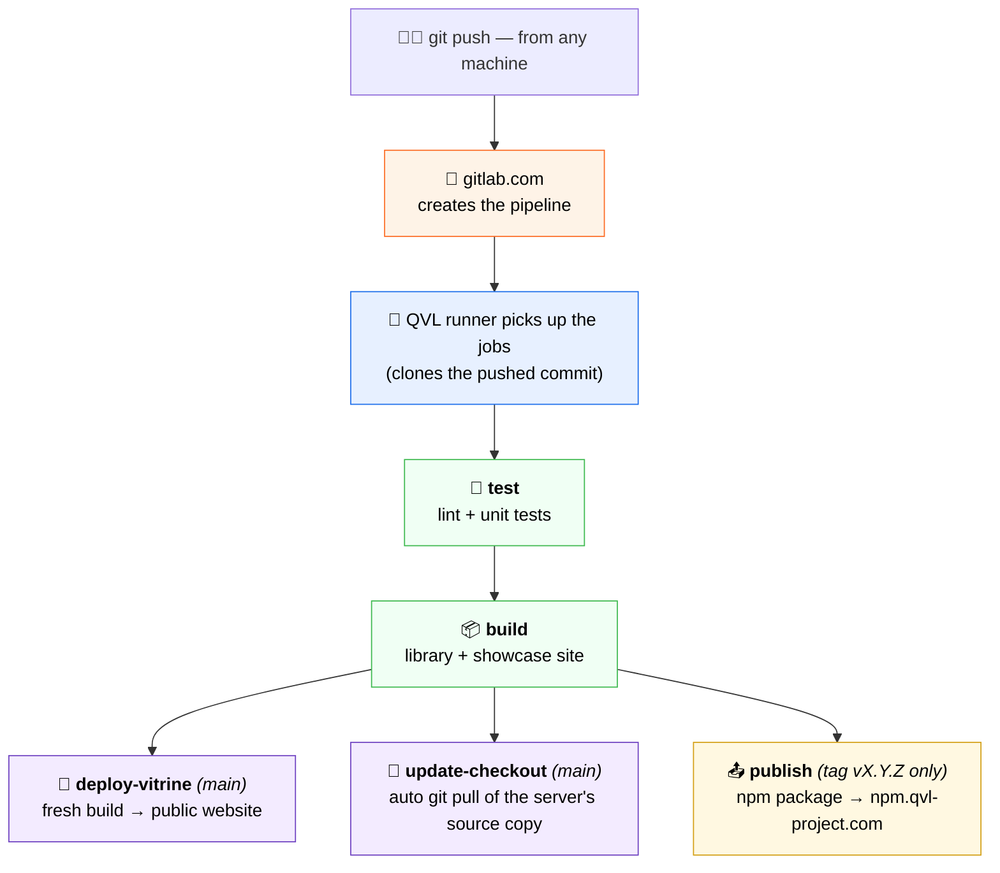
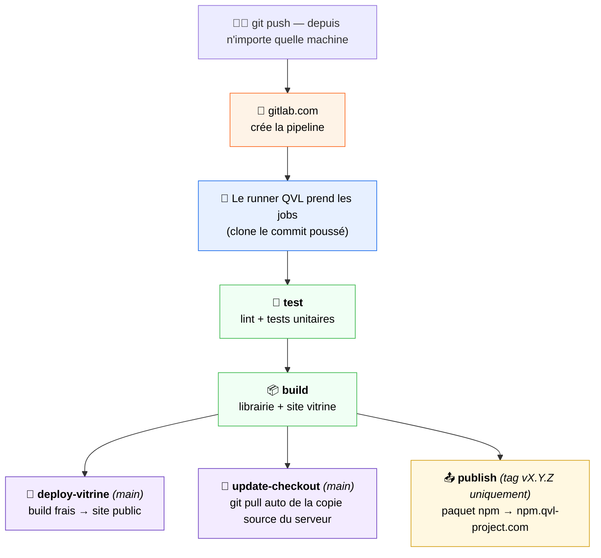

<h1 align="center">🔄 QVL · CI/CD Pipeline</h1>

<p align="center">
  <em>Push from anywhere — tests, deployment and publishing happen on their own.</em><br>
  <em>Pousse ton code de n'importe où — tests, déploiement et publication se font tout seuls.</em>
</p>

<p align="center">
  
  
  
  
</p>

<p align="center">
  <strong>🌐 Read in :</strong>&nbsp;
  <a href="#-english">🇬🇧 English</a>&nbsp;·&nbsp;
  <a href="#-français">🇫🇷 Français</a>
</p>

---

<!-- ============================== ENGLISH ============================== -->
<details open>
<summary><h3>🇬🇧&nbsp;&nbsp;English</h3></summary>

<a id="-english"></a>

## 🎯 In one sentence

Every `git push` to gitlab.com automatically triggers an **assembly line** (a *pipeline*): the code is **tested**, **built**, **deployed** to the public website, the server's **source copy is refreshed**, and — when a version tag is pushed — the library is **published** to the private npm registry. All of it computed **on the QVL machine**, consuming **zero** gitlab.com minutes.

> 💬 **Not a developer?** Picture a factory conveyor belt. You drop a package on the belt (a `git push`); the factory then checks it (**tests**), assembles it (**build**), puts it on the shelf for everyone to see (**deploy**), and files a copy in the archive room (**source sync**). Nobody touches anything by hand — and if a check fails, the belt stops before anything broken reaches the shelf.

## 🧩 Who does what?

A pipeline involves **two very different roles** — this distinction explains the whole architecture:

| Role | Who | Meaning |
|---|---|---|
| 🧠 **Orchestration** | gitlab.com | Decides *what* to run, displays results, keeps history |
| 💪 **Computation** | The QVL machine (*runners*) | Actually *executes* the jobs — clones the code, runs the commands |

Three **self-hosted runners** live on the QVL machine (inside WSL2). Because they are self-hosted, gitlab.com's free-tier minute quota is **never consumed** — computation is unlimited and free.

> 💡 The runner **clones its own fresh copy** of the repository for every job, straight from gitlab.com. The pipeline never depends on any folder previously present on the machine.

## 🏗️ The full flow



### The jobs, in detail

| Job | Trigger | What it does |
|---|---|---|
| 🧪 `test` | every push | Lint + unit test suite. A failure **stops the pipeline** — broken code never reaches deployment |
| 📦 `build` | every push | Builds the library (`dist/`) and the showcase site (`build/`), kept as *artifacts* |
| 🚀 `deploy-vitrine` | push on `main` | Copies the freshly built site into the folder served at `canopui.qvl-project.com` — **the public site updates itself ~2 min after a push** |
| 🔄 `update-checkout` | push on `main` | Runs a **`git pull` on the server's local source copy**, so the machine always holds up-to-date code. Uses `--ff-only`: if uncommitted local edits diverge, it *fails safely* instead of overwriting anything (`allow_failure` keeps the pipeline green) |
| 📤 `publish` | tag `vX.Y.Z` | Publishes the `canopui` package to the private registry `npm.qvl-project.com` (Verdaccio) |

### Releasing a new version

```bash
npm version patch          # bumps 1.0.1 → 1.0.2 and creates the tag
git push origin main --tags
# → pipeline: test ✓ build ✓ deploy ✓ publish ✓ — nothing else to do
```

## 🔐 Where do configuration & secrets live?

The repository only ever contains `.env.example` files — **documentation, never values**. Real values are injected by the environment that runs the code:

| Layer | Lives in | Used for |
|---|---|---|
| `.env.example` | the repository | documents *which* variables exist |
| **CI/CD variables** | GitLab → Settings → CI/CD → Variables (masked) | secrets needed during pipelines — e.g. the registry publish token |
| Runtime `.env` | on the server only, never in git | secrets of future long-running apps |

> 🛡️ No secret is ever committed. CI/CD variables are masked in job logs and can be defined at **group level** to be shared by every project of the group.

## ⏱️ What to expect

| Event | Delay |
|---|---|
| Push → pipeline starts | seconds (runners poll continuously) |
| Push on `main` → public site updated | ~2 minutes |
| Push → server source copy refreshed | ~2 minutes |
| Machine off during a push | jobs wait as `pending`, run automatically when the machine is back |

</details>

<!-- ============================== FRANÇAIS ============================== -->
<details>
<summary><h3>🇫🇷&nbsp;&nbsp;Français</h3></summary>

<a id="-français"></a>

## 🎯 En une phrase

Chaque `git push` vers gitlab.com déclenche automatiquement une **chaîne de montage** (une *pipeline*) : le code est **testé**, **construit**, **déployé** sur le site public, la **copie source du serveur est rafraîchie**, et — quand un tag de version est poussé — la librairie est **publiée** sur le registre npm privé. Le tout calculé **sur la machine QVL**, en consommant **zéro** minute gitlab.com.

> 💬 **Pas développeur ?** Imagine un tapis roulant d'usine. Tu déposes un colis sur le tapis (un `git push`) ; l'usine le contrôle (**tests**), l'assemble (**build**), le met en rayon à la vue de tous (**déploiement**), et en classe une copie aux archives (**synchro du source**). Personne ne touche à rien à la main — et si un contrôle échoue, le tapis s'arrête avant qu'un produit défectueux n'atteigne le rayon.

## 🧩 Qui fait quoi ?

Une pipeline fait intervenir **deux rôles très différents** — cette distinction explique toute l'architecture :

| Rôle | Qui | Signification |
|---|---|---|
| 🧠 **Orchestration** | gitlab.com | Décide *quoi* lancer, affiche les résultats, garde l'historique |
| 💪 **Calcul** | La machine QVL (*runners*) | *Exécute* réellement les jobs — clone le code, lance les commandes |

Trois **runners auto-hébergés** vivent sur la machine QVL (dans WSL2). Parce qu'ils sont auto-hébergés, le quota de minutes du plan gratuit gitlab.com n'est **jamais entamé** — le calcul est illimité et gratuit.

> 💡 Le runner **clone sa propre copie fraîche** du dépôt à chaque job, directement depuis gitlab.com. La pipeline ne dépend jamais d'un dossier déjà présent sur la machine.

## 🏗️ Le flux complet



### Les jobs, en détail

| Job | Déclencheur | Ce qu'il fait |
|---|---|---|
| 🧪 `test` | chaque push | Lint + suite de tests unitaires. Un échec **arrête la pipeline** — du code cassé n'atteint jamais le déploiement |
| 📦 `build` | chaque push | Construit la librairie (`dist/`) et le site vitrine (`build/`), conservés comme *artefacts* |
| 🚀 `deploy-vitrine` | push sur `main` | Copie le site fraîchement construit dans le dossier servi sur `canopui.qvl-project.com` — **le site public se met à jour tout seul ~2 min après un push** |
| 🔄 `update-checkout` | push sur `main` | Effectue un **`git pull` sur la copie source locale du serveur**, pour que la machine dispose toujours du code à jour. Utilise `--ff-only` : si des modifications locales non commitées divergent, le job *échoue proprement* au lieu d'écraser quoi que ce soit (`allow_failure` garde la pipeline verte) |
| 📤 `publish` | tag `vX.Y.Z` | Publie le paquet `canopui` sur le registre privé `npm.qvl-project.com` (Verdaccio) |

### Sortir une nouvelle version

```bash
npm version patch          # passe 1.0.1 → 1.0.2 et crée le tag
git push origin main --tags
# → pipeline : test ✓ build ✓ deploy ✓ publish ✓ — rien d'autre à faire
```

## 🔐 Où vivent la configuration & les secrets ?

Le dépôt ne contient jamais que des fichiers `.env.example` — **de la documentation, jamais de valeurs**. Les vraies valeurs sont injectées par l'environnement qui exécute le code :

| Niveau | Vit dans | Sert à |
|---|---|---|
| `.env.example` | le dépôt | documenter *quelles* variables existent |
| **Variables CI/CD** | GitLab → Settings → CI/CD → Variables (masquées) | les secrets nécessaires pendant les pipelines — ex. le token de publication du registre |
| `.env` de runtime | sur le serveur uniquement, jamais dans git | les secrets des futures applications qui tournent en continu |

> 🛡️ Aucun secret n'est jamais commité. Les variables CI/CD sont masquées dans les logs des jobs et peuvent être définies au **niveau du groupe** pour être partagées par tous les projets du groupe.

## ⏱️ À quoi s'attendre

| Événement | Délai |
|---|---|
| Push → démarrage de la pipeline | quelques secondes (les runners interrogent en continu) |
| Push sur `main` → site public à jour | ~2 minutes |
| Push → copie source du serveur rafraîchie | ~2 minutes |
| Machine éteinte pendant un push | jobs en attente (`pending`), exécutés automatiquement au retour de la machine |

</details>

---

<p align="center">
  <sub>© QVL — Documentation · <a href="../README.md">Hub</a> · Voir aussi : <a href="../hebergement/hebergement-gitlab.md">Hébergement GitLab</a> · <a href="../hebergement/tunnel-cloudflare.md">Tunnel Cloudflare</a></sub><br>
  <sub>Crafted solo, with the help of agentic AI 🤖 · Conçu en solo, avec l'aide de l'IA agentique</sub>
</p>
