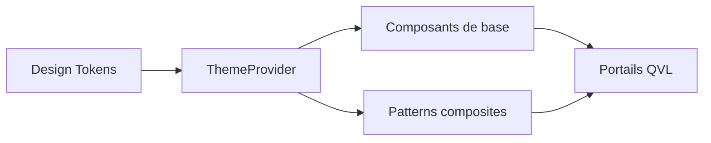

# CanopUI


  

> Design system React de la flotte **QVL**, socle commun de tous les portails.

CanopUI fournit un ensemble de composants accessibles, typés en TypeScript strict et construits au-dessus de MUI. La librairie est distribuée via Verdaccio et consommée par les portails (ProjectCenter, Budgy, etc.).

## Sommaire

- [Installation](#installation)
- [Composants](#composants)
- [Feuille de route](#feuille-de-route)
- [Architecture](#architecture)

## Installation

```bash
npm install canopui
```

Pour un développement local sur un portail consommateur, la librairie peut être packagée en tarball :

```bash
npm run build && npm pack
```

## Composants

| Composant   | Statut       | Depuis  | Accessibilité |
|-------------|--------------|---------|---------------|
| Button      | Stable       | 0.1.0   | AAA           |
| Navbar      | Stable       | 0.9.0   | AA            |
| Carousel    | Bêta         | 1.4.0   | AA            |
| Collapse    | Stable       | 1.1.0   | AA            |
| DataTable   | Expérimental | 1.4.0   | En cours      |

## Feuille de route

- [x] Thème clair / sombre
- [x] Composant Carousel
- [ ] Tokens de design exportables en CSS variables
- [ ] Mode RTL complet
- [ ] Documentation interactive (Storybook)

## Architecture

Le diagramme ci-dessous décrit la circulation des tokens de design vers les composants.



<details>
<summary>Conventions de contribution (cliquer pour déplier)</summary>

- Une branche par feature : `feat/SCRUM-XXX-<desc>`
- Aucun commentaire dans le code : le code doit être auto-explicatif
- Séparation logique / présentation via hooks
- Tests obligatoires sur les composants exportés

</details>

## Liens utiles

- [Guide d'hébergement](../../hebergement/README.md)
- [Pipeline CI/CD](../../pipeline/README.md)
- Dépôt miroir : <https://github.com/QVL-Studio/CanopUI>

---

_Documentation maintenue par la flotte QVL-Studio._
