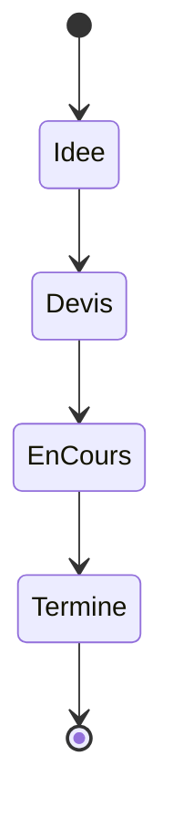

# CasaPlan

 

> Suivi des projets d'aménagement de la maison (**QVL-CustHome**).

CasaPlan aide à planifier les travaux, suivre le budget par pièce et centraliser les devis des artisans.

## Sommaire

- [Modules](#modules)
- [Budget par pièce](#budget-par-pièce)
- [À faire](#à-faire)
- [Cycle d'un projet](#cycle-dun-projet)

## Modules

| Module            | État      | Notes                          |
|-------------------|-----------|--------------------------------|
| Gestion de pièces | Livré     | Ajout / édition / archivage    |
| Suivi de budget   | En cours  | Ventilation par catégorie      |
| Devis artisans    | Planifié  | Import PDF envisagé            |
| Planning travaux  | Idée      | Vue calendrier                 |

## Budget par pièce

- [x] Saisie du budget prévisionnel
- [x] Suivi des dépenses réelles
- [ ] Écart prévisionnel / réel en temps réel
- [ ] Alerte de dépassement

## À faire

Prochaines étapes du projet

- Finaliser la ventilation du budget par catégorie
- Ajouter l'import de devis au format PDF
- Concevoir la vue planning des travaux
- Export récapitulatif pour partage familial

## Cycle d'un projet

## Liens utiles

- [Retour à l'accueil de la documentation](../../README.md)
- Dépôt miroir : <https://github.com/QVL-CustHome/CasaPlan>

---

_Aménagez malin !_
