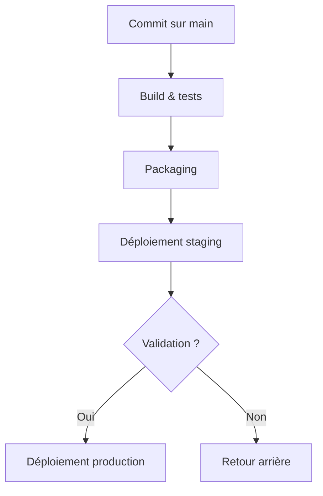

# PipeBoard

 

> Tableau de bord des pipelines et de l'outillage interne (**QVL-ToolBox**).

PipeBoard agrège l'état des pipelines CI/CD de la flotte et donne une vue consolidée des déploiements, des temps d'exécution et des échecs récents.

## Sommaire

- [Vue d'ensemble](#vue-densemble)
- [Indicateurs](#indicateurs)
- [Backlog](#backlog)
- [Chaîne de déploiement](#chaîne-de-déploiement)

## Vue d'ensemble

| Pipeline        | Environnement | Dernier run | Statut   |
|-----------------|---------------|-------------|----------|
| build-canopui   | prod          | 12 min      | Succès   |
| deploy-portails | prod          | 34 min      | Succès   |
| e2e-nightly     | staging       | 6 h         | Échec    |
| lint-global     | ci            | 3 min       | Succès   |

## Indicateurs

- [x] Taux de réussite des pipelines
- [x] Durée moyenne d'exécution
- [ ] Alerte Teams sur échec consécutif
- [ ] Historique des artefacts par version

## Backlog

Éléments en attente de priorisation

- Widget de tendance sur 30 jours
- Filtrage par équipe et par section QVL
- Export CSV des métriques
- Vue mobile compacte

## Chaîne de déploiement

## Liens utiles

- [Documentation pipeline](../../pipeline/README.md)
- Dépôt miroir : <https://github.com/QVL-ToolBox/PipeBoard>

---

_Supervisé par l'équipe outillage QVL._
