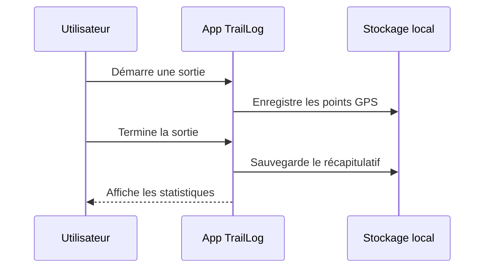

# TrailLog

 

> Carnet de randonnées et de sorties outdoor de la section **QVL-Hobbies**.

TrailLog permet d'enregistrer ses sorties, de suivre le dénivelé, la distance et de garder une trace de ses itinéraires favoris.

## Sommaire

- [Fonctionnalités](#fonctionnalités)
- [Statistiques suivies](#statistiques-suivies)
- [Roadmap](#roadmap)
- [Flux d'enregistrement](#flux-denregistrement)

## Fonctionnalités

| Fonctionnalité        | État        | Priorité |
|-----------------------|-------------|----------|
| Journal de sorties    | Livré       | Haute    |
| Import de traces GPX   | En cours    | Haute    |
| Carte interactive     | Planifié    | Moyenne  |
| Partage social        | Idée        | Basse    |

## Statistiques suivies

- [x] Distance parcourue
- [x] Dénivelé positif / négatif
- [ ] Vitesse moyenne glissante
- [ ] Estimation de la dépense calorique

## Roadmap

Détail des prochaines versions

- **0.7** : import GPX et prévisualisation de la trace
- **0.8** : carte interactive avec fond topographique
- **1.0** : synchronisation multi-appareils

## Flux d'enregistrement

## Liens utiles

- [Retour à la documentation d'hébergement](../../hebergement/README.md)
- Dépôt miroir : <https://github.com/QVL-Hobbies/TrailLog>

---

_Bonnes randos !_
